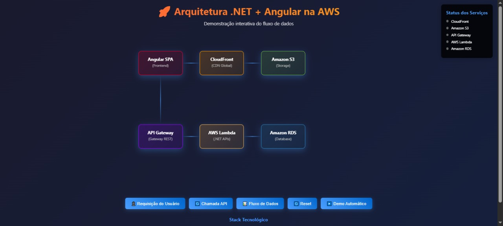

# Visualização Interativa de Arquitetura AWS (.NET + Angular)

Esta aplicação web apresenta uma visualização interativa de uma arquitetura típica na AWS, utilizando .NET no backend (Lambda) e Angular no frontend, com recursos visuais para simular e explicar o fluxo de dados entre os serviços.

## Funcionalidades

---

## Diagrama da Arquitetura



> **Legenda:**
> - **SPA Angular** → **CloudFront** → **Amazon S3** (conteúdo estático)
> - **SPA Angular** → **API Gateway** → **Lambda (.NET)** → **Amazon RDS** (API/dados)

---
- **Visualização gráfica** dos principais componentes AWS: Angular SPA, CloudFront, S3, API Gateway, Lambda (.NET), RDS.
- **Simulação de fluxos** de requisição, chamada de API e fluxo de dados completo.
- **Balão explicativo interativo**: ao clicar nos botões, um balão aparece com explicação em português sobre o fluxo selecionado.
- **Estilo moderno e responsivo**: CSS profissional, animações e layout adaptável a diferentes tamanhos de tela.

## Tecnologias Utilizadas
- HTML5, CSS3, JavaScript puro
- Python 3 + Flask (para servir localmente)

## Organização Recomendada de Pastas

```
AWS-API-REST/
├── README.md
├── requirements.txt
└── src/
    ├── app.py
    ├── index.html
    └── assets/
        ├── css/
        │   └── style.css
        └── js/
            └── Fluxo.js
```

- Separe imagens, ícones ou outros arquivos estáticos em `assets/img` se necessário.

## Como Executar Localmente
1. **Pré-requisitos:**
   - Python 3 instalado
   - Flask instalado (`pip install flask`)

2. **Execute o servidor Flask:**
   ```bash
   python src/app.py
   ```

3. **Acesse no navegador:**
   - Abra `http://localhost:5000` para visualizar a aplicação.

## Estrutura dos Arquivos
- `src/index.html` — Arquivo principal (HTML), agora referenciando arquivos externos de JS e CSS.
- `src/assets/js/Fluxo.js` — Código JavaScript principal da visualização e interatividade.
- `src/assets/css/style.css` — Arquivo de estilos (CSS) para todo o visual da aplicação.
- `src/app.py` — Servidor Flask simples para servir a aplicação.
- `README.md` — Este manual.

## Como Usar
- Clique nos botões para simular diferentes fluxos:
  - **Requisição do Usuário:** Mostra o caminho do conteúdo estático.
  - **Chamada API:** Demonstra o fluxo de uma chamada de API.
  - **Fluxo de Dados:** Simula o ciclo completo dos dados.
  - **Reset:** Limpa as animações.
  - **Demo Automático:** Executa todos os fluxos em sequência.
- Ao clicar, um balão explicativo aparece no canto inferior direito com detalhes do fluxo.

## Personalização
- Os textos dos balões e o visual podem ser facilmente ajustados no arquivo `index.html`.
- Caso queira adicionar novos fluxos ou componentes, basta seguir o padrão já existente no código.

## Deploy em Produção
- O projeto pode ser hospedado em qualquer serviço capaz de rodar Python (como AWS EC2, Heroku, PythonAnywhere) ou como página estática em S3/CloudFront (removendo o Flask).

## Autor
Desenvolvido por [Seu Nome].

---

Se precisar de ajuda ou quiser sugerir melhorias, fique à vontade para abrir uma issue ou entrar em contato!
